# 🗺️ Diagrams

## Data Flow Pipeline

> End-to-end data flow: from URL discovery to database storage, including HTTP workers and error handling.

```mermaid
flowchart TD
    A[🌐 Web Pages] --> B[📋 URL Discovery]
    C[📊 Brand List] --> B
    D[🔗 Direct URLs] --> B
    B --> E[⚙️ Config Validation]
    E --> F[🚀 Parser Init]
    F --> G[🌐 HTTP Client Setup]
    G --> H[🗄️ Database Manager]
    H --> I{🔄 Processing Type}
    I -->|📊 Listings| J[📋 Get Brands/Pages]
    J --> K[🌐 HTTP Requests]
    K --> L[📄 HTML Download]
    L --> M[🔍 HTML Parsing]
    M --> N[📊 Data Extraction]
    N --> O[💾 Save Listings]
    I -->|📄 Details| P[📋 Get Items for Details]
    P --> Q[🌐 HTTP Requests]
    Q --> R[📄 HTML Download]
    R --> S[🔍 HTML Parsing]
    S --> T[📊 Data Extraction]
    T --> U[💾 Save Details]
    I -->|🌐 HTML| V[📋 Get Items for HTML]
    V --> W[🌐 HTTP Requests]
    W --> X[📄 HTML Download]
    X --> Y[💾 Save HTML Content]
    I -->|🔄 Full| Z[📊 Run All Pipelines]
    Z --> J
    Z --> P
    Z --> V
    O --> AA[🔄 Data Validation]
    U --> AA
    Y --> AA
    AA --> BB[📊 Data Transformation]
    BB --> CC[💾 Database Storage]
    K --> DD[🚀 HttpWorkerManager]
    Q --> DD
    W --> DD
    DD --> EE[👥 Worker Pool]
    EE --> FF[🔧 ProxyAssigner]
    FF --> GG[🔄 SmartProxyManager]
    GG --> HH[🌐 Auto-Proxy Rotation]
    HH --> II[📊 Proxy Success/Failure Tracking]
    II --> JJ[🔄 Automatic Retry Logic]
    L --> KK[❌ Error Detection]
    R --> KK
    X --> KK
    KK --> LL[🔄 Retry Logic]
    LL --> MM[📊 Error Logging]
    MM --> NN[🔄 Fallback Strategy]
    JJ --> KK
    O --> OO[📡 Progress Events]
    U --> OO
    Y --> OO
    OO --> PP[🌐 WebSocket Broadcast]
    OO --> QQ[📊 Statistics Update]
    CC --> RR[🗄️ Peewee ORM Operations]
    RR --> SS[💾 Batch Processing]
    SS --> TT[📊 Statistics Collection]
    TT --> UU[📋 Results Aggregation]
    UU --> VV[📊 Final Statistics]
    VV --> WW[✅ Success Response]
    NN --> XX[❌ Error Response]
```

## Database Operations Flow

> How the Demo Parser saves and retrieves data using Peewee ORM and SQLite3.

```mermaid
flowchart TD
    A[🎯 DemoParser] --> B[🗄️ DemoDatabaseManager]
    B --> C[💾 Save Single Listing]
    B --> D[💾 Save Single Detail]
    B --> E[📦 Save Listings Batch]
    B --> F[📦 Save Details Batch]
    B --> G[📊 Get Statistics]
    B --> H[📋 Get Items for Details]
    B --> I[🌐 Get Items for HTML]
    C --> J[🐍 Peewee ORM]
    D --> J
    E --> J
    F --> J
    G --> J
    H --> J
    I --> J
    J --> K[💾 SQLite3 Database]
    K --> L[📁 demo_parser.db]
    L --> M[📋 DemoItem Table]
    M --> N[📊 Data Storage]
    N --> O[🎭 Demo Data]
    O --> P[📋 Mock Listings]
    O --> Q[📄 Mock Details]
    O --> R[🌐 Mock HTML Content]
    J --> S[⚡ Async Operations]
    S --> T[🔄 Batch Processing]
    T --> U[📊 Statistics Collection]
    U --> V[📈 Statistics]
    V --> W[📊 Total Items]
    V --> X[📋 Listings Count]
    V --> Y[📄 Details Count]
    J --> Z[❌ Error Handling]
    Z --> AA[🔄 Retry Logic]
    AA --> BB[📊 Error Logging]
    N --> CC[✅ Success Response]
    CC --> DD[📋 Results Display]
``` 

